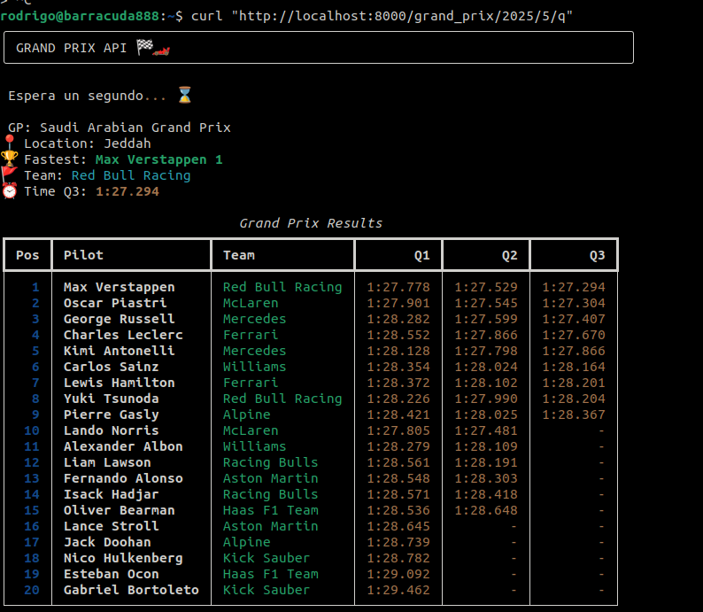

This little project implements an api that prints in terminal the results of formula 1 grand prix.
The api was implemented using FastApi and the data is recoverd using FastF1.
Rich was used to print data in pretty format.

